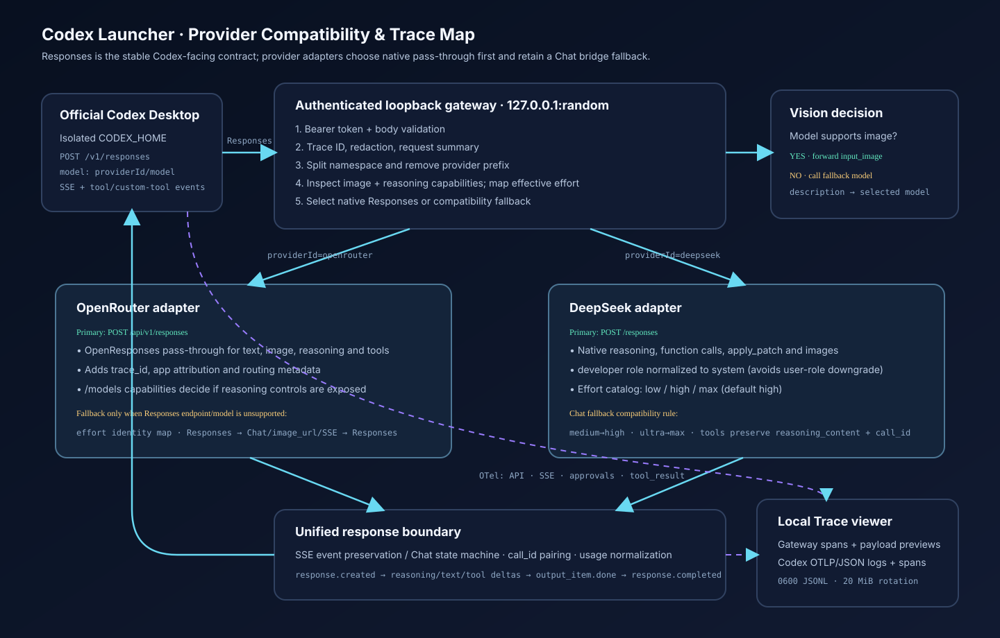

# Codex Launcher

Codex Launcher is a macOS menu-bar application that starts a second, isolated copy of the official Codex Desktop app and routes its model traffic through a local BYOK gateway. The initial providers are OpenRouter and DeepSeek.

The launcher does **not** modify, copy, patch, or re-sign the official application. It starts the installed app with isolated state directories:

```text
Official Codex                       Launcher-managed Codex
~/.codex                             ~/.codex-launcher/codex
~/Library/Application Support/Codex  ~/.codex-launcher/desktop
OpenAI/default provider              Local authenticated gateway
```

## Requirements

- macOS on Apple Silicon (the packaged artifact in this repository is arm64)
- Node.js 20 or newer for development
- The official Codex Desktop app installed in `/Applications`
- An OpenRouter or DeepSeek API key

The launcher finds `/Applications/ChatGPT.app` and `/Applications/Codex.app`. Set `CODEX_DESKTOP_APP` to override discovery.

## Run from source

```sh
npm install
./run-app.sh
```

The window lets you save a provider URL/key, fetch the live model catalog, search it, select models, choose each model's default reasoning effort, configure an optional vision fallback, and launch Codex. The interface supports English and Chinese; **System language** is the default. Closing the window or clicking **Stop Codex** leaves the menu-bar Launcher active.

The interface follows the macOS look and feel: system font and rounded, translucent panels; the accent colour stays close to the system blue; and the appearance follows macOS by default, with **Auto / Light / Dark** override stored locally. The layout reflows from a two-column desktop window down to a narrow, phone-sized viewport: below 1080 px the launch bar stacks, below 900 px the sidebar becomes a sticky top bar, and below 640 px the token chart and usage table scroll horizontally instead of squeezing their columns.

Keys are stored in macOS Keychain under service `pro.mintools.codex-launcher`. If Keychain is unavailable, the fallback is an AES-GCM encrypted, machine-bound file with mode `0600`. Local control APIs expose only `hasKey`.

## Isolation and launch behavior

The official Codex configuration lives under `CODEX_HOME`, which defaults to `~/.codex`. Launcher uses `~/.codex-launcher/codex` and generates:

- `config.toml`
- `model_catalog.json`

It starts a new official Desktop instance using macOS `open -n` with both `CODEX_HOME` and `CODEX_ELECTRON_USER_DATA_PATH`. The second variable is supported by the currently inspected Codex Desktop build but is an internal desktop capability, not a documented public compatibility promise. Launcher also supplies a unique `--user-data-dir`, detects running processes by that exact path, and never targets the normal official instance.

Four layers are isolated:

1. State: separate Codex and Electron user-data directories.
2. Authentication: provider keys stay in Launcher storage; Codex receives only a random loopback-gateway token.
3. Network: Codex talks to `127.0.0.1` on a random port.
4. Processes: macOS launches a new Desktop instance; Stop targets only processes carrying Launcher's unique user-data path.

The process matcher verifies both the isolated `--user-data-dir` and the official `Codex.app`/`ChatGPT.app` executable path. It explicitly excludes `Codex Launcher.app`, so stopping Codex does not terminate the tray application.

## Protocol gateway

Codex talks to Launcher with `wire_api = "responses"`. Both bundled providers now expose a native Responses endpoint, so the gateway prefers byte-compatible Responses forwarding and keeps the Chat Completions translator as a narrowly triggered fallback for an endpoint or model that explicitly reports Responses as unsupported.

Supported bridge behavior:

- text input/output, instructions, reasoning items, function/custom tools and tool results
- non-streaming Responses ↔ Chat Completions conversion
- stateful streaming SSE events, including reasoning, text, and function-call argument deltas
- tool argument reassembly and `call_id` preservation
- provider/model namespace routing such as `openrouter/anthropic/claude-...`
- image forwarding for multimodal Chat Completions models
- optional two-stage vision fallback for text-only models
- input/output/total usage capture on native and bridged, streaming and non-streaming paths

Provider-specific normalization currently includes:

- OpenRouter: native `/api/v1/responses`, live `input_modalities` and `supported_parameters`, request `trace_id`, application attribution, and routing metadata. Its Chat endpoint remains the fallback.
- DeepSeek: native `/responses`, `developer` → `system` normalization, stateless history replay, reasoning items, function calls, `apply_patch` custom calls, image input, and usage details. The Chat fallback retains `reasoning_content` on every assistant history message whenever tools are present, as required by DeepSeek.
- Chat fallback: adjacent parallel calls are combined into one assistant `tool_calls` message; every `call_id` is paired with its tool output; streamed reasoning/text/tool deltas are reconstructed into Responses events.

### Reasoning effort mapping

Reasoning choices are model metadata, not a global fixed list. Launcher writes only the choices the selected provider/model advertises, so Codex Desktop does not show unsupported levels:

- DeepSeek models expose `low`, `high`, and `max`, defaulting to `high`, matching DeepSeek's official Codex catalog. Compatibility requests such as Codex `medium` are normalized to `high`; `ultra` is normalized to `max` before forwarding.
- OpenRouter models expose the OpenRouter reasoning range only when the live `/models` record includes a reasoning-related `supported_parameters` capability. Models without it show no reasoning selector.
- The same effective value is sent on native Responses and Chat fallback routes (`reasoning.effort` for Responses/OpenRouter; `reasoning_effort` plus the thinking switch for DeepSeek Chat).

The default can be selected beside each checked model in Launcher. It is also written to `model_catalog.json`, which controls the choices shown by Codex Desktop.

The Responses API is broader than Chat Completions. The fallback does not pretend that arbitrary built-in Responses tools are standard Chat functions. Native Responses is therefore the correctness path; fallback is for older compatible endpoints, not the default.



Official references:

- [Codex configuration reference](https://learn.chatgpt.com/docs/config-file/config-reference)
- [Codex advanced configuration](https://learn.chatgpt.com/docs/config-file/config-advanced)
- [OpenRouter Responses API](https://openrouter.ai/docs/api/api-reference/responses/create-responses)
- [OpenRouter model metadata](https://openrouter.ai/docs/api/api-reference/models/get-models)
- [DeepSeek Responses compatibility](https://api-docs.deepseek.com/guides/responses_api/)
- [DeepSeek thinking and tool-call history](https://api-docs.deepseek.com/guides/thinking_mode/)
- [DeepSeek official Codex integration and model catalog](https://api-docs.deepseek.com/quick_start/agent_integrations/codex/)

### Live compatibility audit

The selected catalog was checked against the live provider APIs on 2026-09-23:

- Both DeepSeek catalog entries and all seven selected OpenRouter entries still exist.
- All nine selected models accepted a native Responses request with a function tool. Eight returned a function call within a 64-token artificial cap. `~moonshotai/kimi-latest` returned HTTP 200 with `status: incomplete` after spending that small cap on reasoning; this is expected truncation, not a protocol failure.
- `deepseek-flash` and `deepseek-v4-pro` returned native reasoning plus function calls.
- DeepSeek and OpenRouter both passed a two-request tool loop: function call → `function_call_output` → final message.
- `deepseek/deepseek-v4-flash-vision-exp` accepted a real inline PNG through native Responses and returned a completed message.

Model aliases and provider behavior can change after this audit. **Fetch models** refreshes capability metadata before selection; the gateway records the actual protocol, route, status, and fallback in Traces so future drift is diagnosable.

## Model catalogs

Provider model results are normalized and cached. Only checked models are written to `model_catalog.json`. Model IDs are namespaced as `providerId/model`, while the gateway removes the first namespace segment before forwarding upstream.

The launcher uses the current `model_catalog_json` configuration key rather than relying on an undocumented `models.json` filename.

### Vision fallback

Choose any selected image-capable model in the **Vision fallback** control. While fallback is enabled, the generated desktop catalog advertises image input for every selected model so Codex Desktop allows the attachment to reach the gateway. The gateway keeps the provider's real capability metadata: when a request contains an image but the active model is actually text-only, it first asks the fallback model for a self-contained visual description. It removes the image, adds that description as context, and then sends the request to the originally selected model. The conversation therefore stays on the user's chosen model. Both calls are recorded against the models that actually handled them. Selecting a fallback is also the explicit opt-in for sending images to a different provider.

If the fallback is disabled, missing, or fails, the gateway returns a clear error instead of repeatedly rerouting the request.

## Usage overview

The gateway stores daily and per-model aggregates in `~/.codex-launcher/usage.json`. The UI shows total/input/output tokens, request count, model share, last use, and 7/14/30-day charts. Reset removes only these local aggregates.

## Traces and debugging

Launcher combines two observability sources:

1. Gateway trace events cover the exact BYOK path: requested/actual model, namespace routing, image fallback, Responses or Chat transport, translated payload previews, upstream HTTP status, first-byte latency, SSE event counts, tool calls, usage, and failures.
2. Codex OpenTelemetry covers the desktop runtime: conversation/API/SSE lifecycle, tool decisions, tool results, durations, and success status. The generated user-level `config.toml` exports logs and spans as OTLP/JSON to Launcher's authenticated loopback collector. `log_user_prompt` is disabled.

### How to view a trace

1. Start Codex Launcher and click **Save & Launch Codex**.
2. Send a message in the isolated Codex Desktop app.
3. Open Launcher from the menu-bar icon and choose **Open Traces**, or open the Launcher window and select **Traces** in the sidebar.
4. Click a trace row to expand its ordered event timeline. Use **Refresh** after a turn is complete. **Clear** removes only local trace history.

Trace records are stored at `~/.codex-launcher/traces.jsonl` with file mode `0600`. The append-only file is compacted automatically at 20 MiB. API keys, authorization fields, passwords, cookies, and inline image bytes are redacted; long strings are truncated. Payloads never leave the machine unless the selected upstream request itself requires them.

Reasoning shown in Traces is only reasoning content or summaries actually returned by the selected provider. Launcher cannot recover a model's hidden chain of thought or decrypt encrypted reasoning content. OpenAI's official Codex documentation likewise makes raw reasoning conditional on whether a model emits it.

If Codex was already running when Launcher was upgraded, stop it and launch it again so the generated `[otel]` endpoints use the current random gateway port.

## Tests

```sh
npm run check
npm test
```

The tests use real loopback HTTP servers and cover routing/auth interception, native and fallback transports, per-provider reasoning catalogs and effort mapping, non-streaming conversion, streamed reasoning/text/tool calls, image forwarding, two-stage vision fallback, custom and parallel calls, argument reconstruction, `call_id`, DeepSeek history requirements, safe isolated-process targeting, OTLP ingestion/redaction/noise filtering, all four usage paths, daily buckets, and descending aggregation.

## Packaging

```sh
CSC_IDENTITY_AUTO_DISCOVERY=false npm run pack
```

This creates an unsigned `.app` and `.zip` in `dist/`. If npm/Electron caches are not writable, redirect them before installing:

```sh
export npm_config_cache="$(mktemp -d)"
export ELECTRON_CACHE="$(mktemp -d)"
export ELECTRON_BUILDER_CACHE="$(mktemp -d)"
npm install
npm run pack
```

To create a local DMG on a Mac after packaging:

```sh
hdiutil create -volname "Codex Launcher" -srcfolder "dist/mac-arm64/Codex Launcher.app" -ov -format UDZO "dist/Codex-Launcher.dmg"
```

Unsigned local builds may require Control-click → Open on first launch. Distribution to other users should use an Apple Developer ID signature and notarization.

## Project layout

- `electron/main.js`: menu bar, window, and application lifecycle
- `src/controller.js`: gateway/Desktop orchestration
- `src/gateway.js`: authenticated loopback Responses endpoint
- `src/translate.js`: Responses/Chat conversion and streaming state machine
- `src/providers.js`: provider presets and model normalization
- `src/generate.js`, `src/catalog.js`: Codex configuration/catalog generation
- `src/store.js`: configuration and secret storage
- `src/usage.js`: usage aggregation and persistence
- `src/trace.js`: redacted JSONL tracing and OTLP/JSON ingestion
- `src/panel.js`, `ui/index.html`: same-origin local control panel
- `bin/codex-launcher.mjs`: standalone CLI runner

## Security notes

- The gateway binds only to `127.0.0.1` and requires a random Bearer token.
- Provider keys are never written to generated Codex configuration and are never returned by panel APIs.
- The generated gateway token is process-local and changes when Launcher restarts.
- OTLP ingestion requires that same random token and is bound to loopback only.
- Configuration and fallback secret files use mode `0600`; state directories use `0700`.
- This project is independent and is not affiliated with or endorsed by OpenAI.
